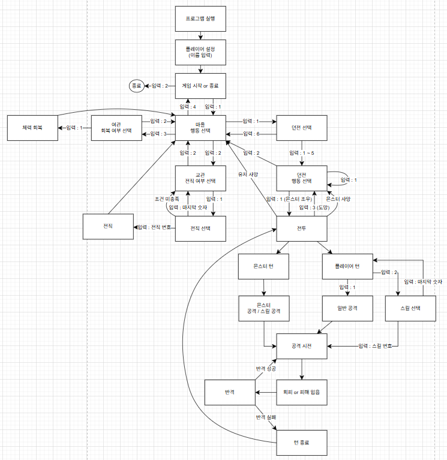
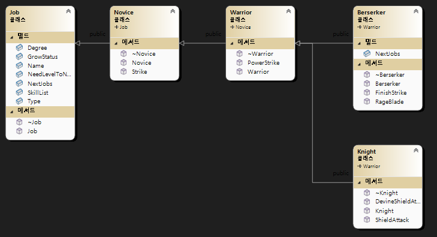
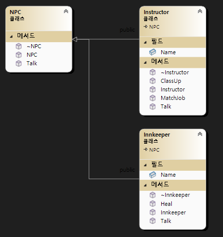

# 개인 프로젝트 1차
- <b>이름: 박준범
- 제목: OutClass

## 텍스트 기반 RPG(Text-based RPG)
- C++로 제작한 간단한 텍스트 기반의 던전 탐험 RPG 입니다.
- 플레이어는 전직을 통해 직업을 선택하고, 몬스터와 싸우며 성장할 수 있습니다.

## 주요 기능
* 턴제 전투 시스템 
    * 플레이어와 몬스터가 속도에 따라 턴을 진행하는 방식에 전투를 구현했습니다.
* 직업 및 스킬 시스템
    * 'Novice'로 시작하여 특정 레벨에 도달하면 상위 직업으로 전직을 할 수 있습니다.
    * 각 직업은 고유한 스킬 목록을 가지며 하위 직업의 스킬을 사용할 수 있습니다.

## 순서도

## 클래스
* 플레이어 및 몬스터 

* 직업 

* NPC 

* 게임 매니져 

* 기타 struct 및 enum class 

